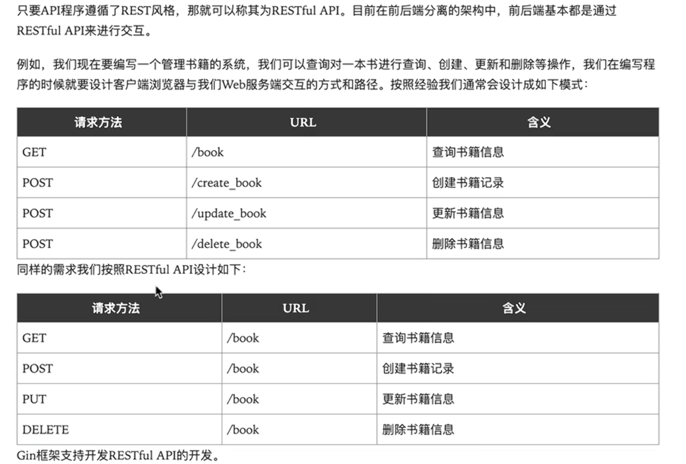
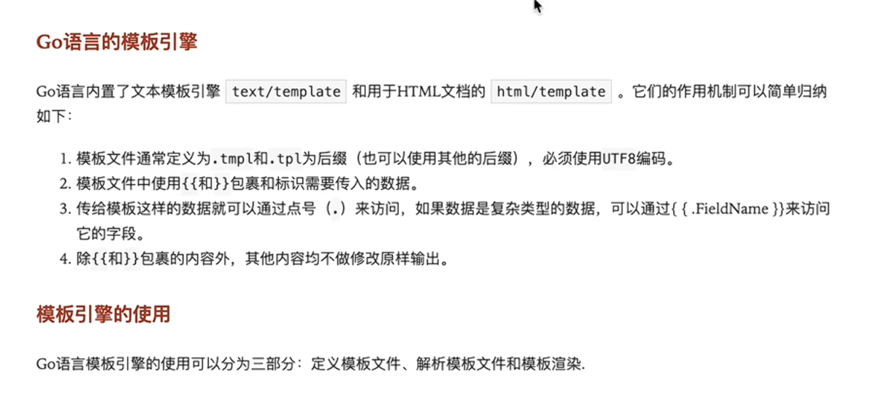
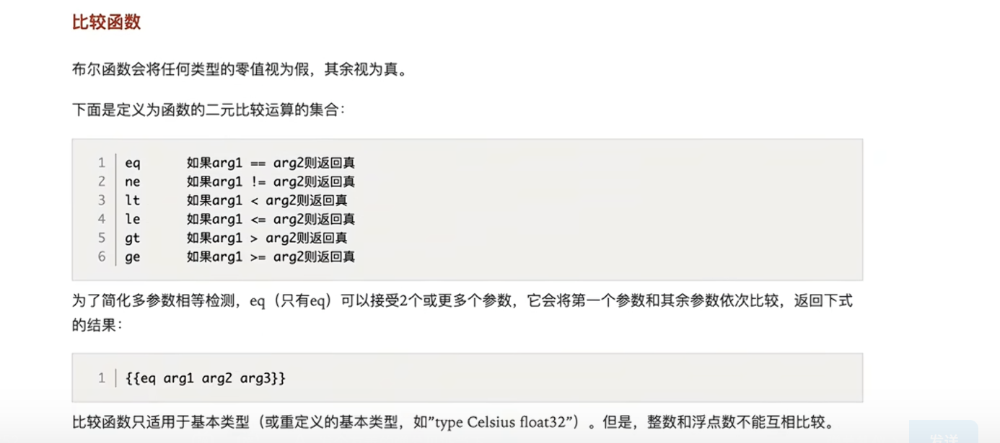
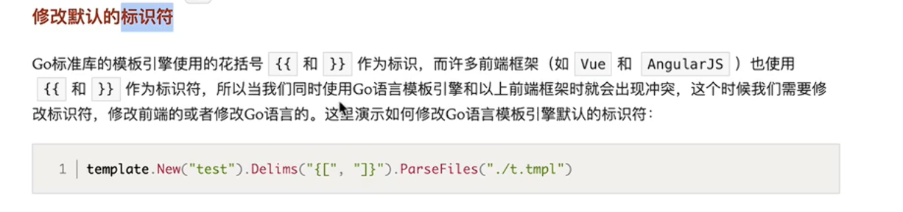
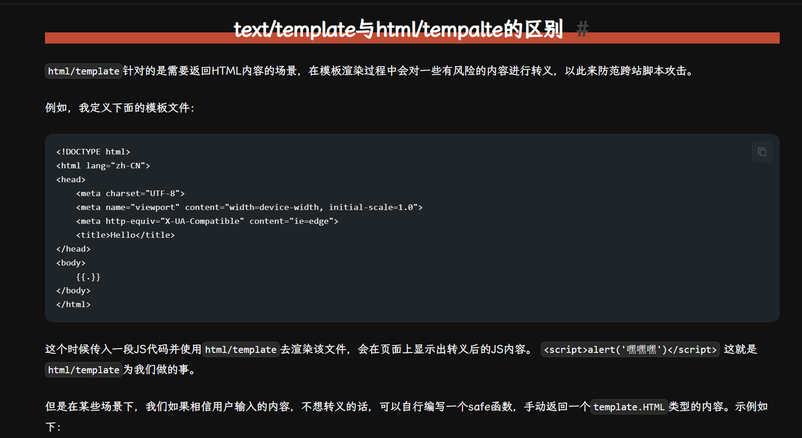

**本项目包含什么？**

* Gin的基础使用
* GORM的基础使用
* Web开发小实战

- 什么是Web？
- Web是基于HTTP协议进行交互的应用网络
- Web就是通过使用浏览器/App访问的各种资源

- 由浏览器发起一次请求，服务器做出一个回应
- 一个请求对应一个回应

**r := gin.Default()  // 创建路由引擎**
-这段代码完成了三个动作

- | 动作        | 通俗解释                              | 生活类比            |
  | --------- | --------------------------------- | --------------- |
  | **开公司大门** | 启动一个 HTTP 服务器，开始监听端口              | 公司前台开门营业        |
  | **准备登记本** | 创建一张空的路由表（路径 → 处理函数）              | 前台放一本"部门指引手册"   |
  | **配基础装备** | 默认带上 Logger（记录日志）和 Recovery（崩溃恢复） | 前台配了监控摄像头 + 急救包 |

**RESTful API**
-
- 什么是RESTful? REST是Representation State Transfer的简称
- 中文翻译为“表征状态转移”
- 简单来说REST的含义就是客户端与服务端之间进行交互时，使用HTTP协议中的4个请求方法代表不同的动作
- GET用来获取资源
- POST用来新建资源
- PUT用来更新资源
- DELETE用来删除资源
- 只要API遵循这个风格就可以称之为RESTful API
- 

**模板与渲染**
-
- 在一些前后端不分离的Web架构中，我们通常需要在后端将一些数据渲染到HTML文档中，
- 从而实现动态的网页效果。（网页的布局和格式大致一样，但展示的内容并不一样）
- 模板可以理解为事先定义好的HTML文档文件，模板渲染的作用机制可以简单理解为文本替换操作-使用相应数据去替换HTML文档中事先做好的标记
- 
- 
- 
- 
- 简单来说，text/template 就是文本替换
- 而html/template会将危险字符自动转义

- Rendering_1:最简单的模板渲染流程
- Rendering_2:传入结构体/map字段or value 模板内置函数
- Rendering_3:自定义函数 嵌套模板
- Rendering_4:模板继承
- Rendering_5:修改引擎修饰符以及html/template的自动转义
- Rendering_6:Gin框架下的渲染